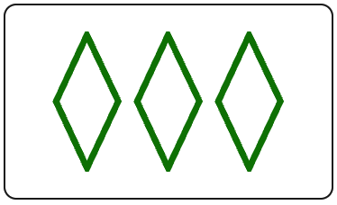

# SetSolverWithFineTunedYOLO
A program to win at Set with Friends!

## Demo
A video demo of the model completing a solo game of set VideoDemoSetSolver.mov

## Instructions
Run main.py and then quickly switch over to a fullscreen tab with a Set with Friends (https://setwithfriends.com/) game running.
This program will then automatically detect the Set cards on the board, determine which of the detected cards make a set,
and then click on the cards in quick succession. This process will repeat indefinitely, so terminate the program after
the game has been completed. The program is currently configured for the M2 Macbook Air with a 2560 × 1664 resolution. 
Changes to the defined board region will need to be made in mss_detection.py to comply with different display configurations.

## Development Process

### Motivation
I decided to start this project for two reasons:
1. I wanted a coding project that would allow me to strengthen my Python development skills. I was hoping to create a codebase 
utilizing computer vision and automation libraries to interact with a website in realtime.
2. My friends and I had been playing a lot of Set and I was tired of losing.

### Experimentation
My initial goal was getting a python program to interact with a browser tab. By passing an image of a text box, I was
then able to use pyautogui "locate", "click", and "write" functions to find the text box, click and then type out a message.
Next, I wanted to verify sequential image detection so I took screenshots of buttons of numbers and operators on Google's 
calculator page, and then similarly used "locate" and "click" to compute a basic math equation. The final test was to try the
sequential detection out on a Set with Friends game. I saved photos of 3 set cards that contained a set and then automated a
series of clicks to give the program its first set.

### Data Collection
In total, I saved screenshots of all 81 possible Set cards by playing through a full game individually. For each photo I included
the full area contained withing the border of a card, with some minor padding outside of it. This was done so that, for example,
during image detection a set Card containing a single diamond wouldn't be found within a card that contained three diamonds with 
the same attributes. After gathering the screenshots, I then converted each image to png format using "Paintbrush" 
(https://paintbrush.sourceforge.io/) naming each file based upon the attributes of the Set card the image contained, in the format
color_number_shape_filling, to make later filename conversion simple. Lastly, I stored them in the "iconPics" folder. Below is
an example of a set card from the folder:

  

### Programming Set Detection
With all the possible set cards saved, the challenge was now how to automate the process of recognizing all the Set cards on
screen, determining which three cards formed a Set, and then clicking on these cards in succession, all at a speed fast enough
to beat human players. This program tries to be as efficient as possible by limiting the amount of image search needed to be done,
the most time-consuming function of the overall program. 

First, the program will initialize an array with all possible set cards as filenames. Next the function will call the
"getFilenames" function to search for all possible filenames on the current board. Notably, once three cards are found, the
function will internally call the "getSet" function to see if a set can be made with the cards currently found on the board.
This action will be repeated after each new card is found, until a valid set can be made, at which point the function will then return
the cards currently found, optimizing the amount of time spent searching for card images. Should a possible set be found, the function
will then get the filenames that make up the set, and then pass them into the "clickTarget" function, where pyautogui is used
to automate the movement of the mouse to click the set.

A special case is that when the set is not found in the initial board, the search region is expanded to encompass an additional
120 pixels of height, where the potential fifth row of cards could be found. Then, a condition is passed to the searching and clicking
functions in order to expand the scope of their search, allowing a set containing cards in this bonus row to be found and clicked on.

After a set has been found and clicked on, the cards that make up the set are removed from the array of cards to be searched from
optimizing the performance of each iteration of search. Then a short time delay enacted in order to buffer the program while the card
shuffle animation occurs on screen, before a new iteration of search takes place.

### Testing
To test the performance of my model, I entered it into 1v1 matchups with two of my friends with the best Set skills. It defeated
both of them, over multiple games and by wide margins, validating the programs performance. The model noticeable got faster over the course of each
game, as the found Set cards were removed from the search array, something that my opponents picked up on. Overall the testing
phase was highly successful.

## Future Improvements
While the model was efficient enough to beat my friends as a benchmark, there are certain improvements that could improve both
the models performance and the programs usability as a whole:

1. Allow easy adaptation to different monitor setups (create a testing file to gather resolution details and pass to program)
2. Pass out coordinates of found Set cards directly to the "clickTarget" to eliminate the repeated image search when clicking
3. Configure the wait time between loops of the set detection algorithm to account for the exact shuffle animation timing
4. Implement an alternative check for the bonus row prior to search (pixel that is colored/not when bonus row is active)

